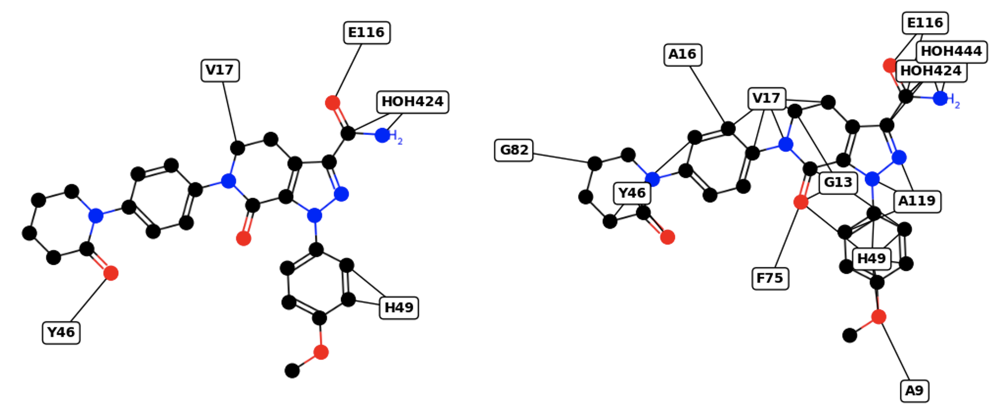

# SimPLI - Simple Protein Ligand Interaction

Description
-----------

SimPLI (*Simple Protein Ligand Interaction*) is a simple tool to make a PNG plot
showing interaction between a protein (.PDB) and a ligand (.SDF). Currently, interactions
are shown based on a distance cutoff between protein and ligand atoms. 
Updated version uses the spring_layout function from the netowrkx package to visualize the interactions.


Instructions
------------

```
conda env create -f environment.yml
conda activate simpli

# Inputs: (1) PDB file, (2) SDF file, and (3) distance cutoff in A
# Output: simpli.png
# Note: Example from DiffDock HuggingFace. GG2 removed from PDB.
python simpli.py -p examples/6w70.xgg2.pdb -l examples/6w70.rank1.sdf -d 2
```

Examples using -d 2 (left) and 3 (right)

